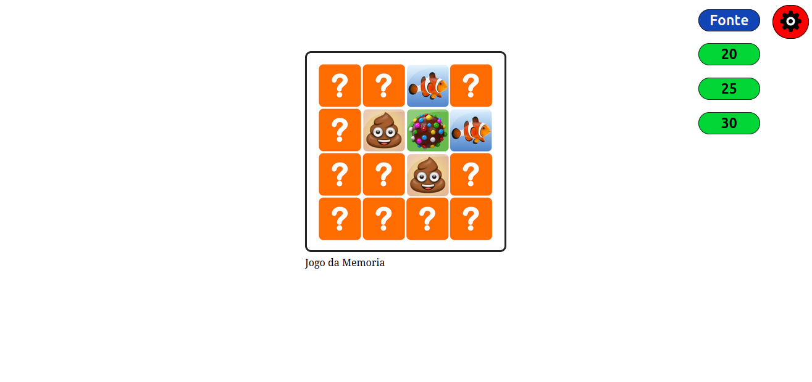
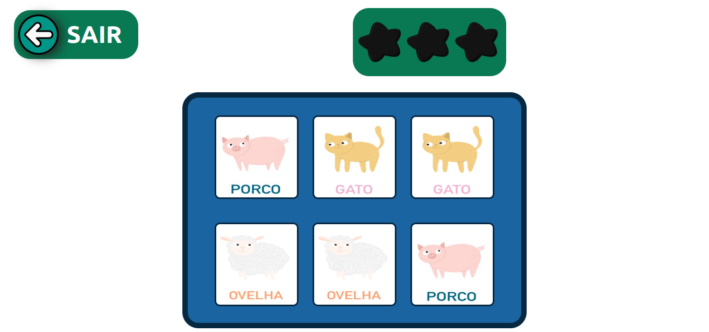
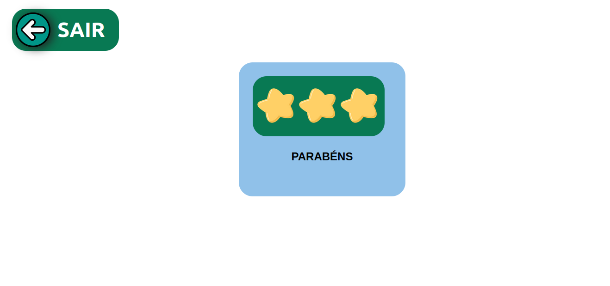

<h1 align="center"> Plataforma de jogos TEA</h1>


<div align="center">


</div>


* [Descrição do Projeto](#descrição-do-projeto)
* [Funcionalidades e Demonstração da Aplicação](#funcionalidades-e-demonstração-da-aplicação)
* [Acesso ao Projeto](#acesso-ao-projeto)
* [Tecnologias utilizadas](#tecnologias-utilizadas)
* [Conclusão](#conclusão)


## Descrição do Projeto

Objetivo Geral:
O projeto busca desenvolver soluções eficazes para o aprendizado de crianças autistas, utilizando ferramentas digitais que facilitem e potencializem o desenvolvimento de habilidades essenciais.

Público-Alvo:
O aplicativo é voltado para crianças com Transtorno do Espectro Autista (TEA) na faixa etária de 4 a 6 anos, uma fase crucial para o desenvolvimento cognitivo, motor e social.

Interface do Aplicativo:
O aplicativo contará com um catálogo de mini-jogos, onde cada jogo oferece uma jornada que vai do nível fácil ao difícil. Esses jogos são desenhados para atender às necessidades específicas das crianças com TEA, promovendo um aprendizado gradual e adaptado às capacidades individuais de cada usuário.


## Funcionalidades e Demonstração da Aplicação

Na Plataforma, a tela inicial da aplicação possui um minijogo "jogo da memoria" e um menu lateral que permite alterar o tamanho da fonte, bem como o da imagem.



----

Ao clicar no minijogo, o usuário é transportado para a página do Jogo da Memória. O jogo inicia revelando as posições dos cartões com animais. Para pontuação, foi adicionado 3 estrelas vazias, como estimulo para ganhar estrelas.



<br>

Após a cronometragem de 4 segundos, todos os cartões são escondidos, para que a pessoa com TEA possa escolher um par de cartões iguais.

Ao acertar, o usuário recebe um estímulo positivo visual e sonoro, além de ganhar uma estrela.

Em caso da resposta incorreta, haverá uma indicação visual e sonora.

---

Se houver ganho das 3 estrelas, o usuário é direcionado à pagina, na qual será exibido o total de estrelas ganhadas e um comentário de "Parabéns" para o usuário, como um estímulo visual e "feedback". 



----

#### Demostração da Aplicação

Assista aqui ↓

[](./images/video.mp4)


## Acesso ao Projeto

#### *Passo a Passo:*

1- ```git clone  https://github.com/and3510/Projeto_App_Autismo.git```

2- ``` Abrir no navegador pela IDEA ```


## Tecnologias utilizadas:
- JavaScript 
- HTML5
- CSS3
- Vscode

